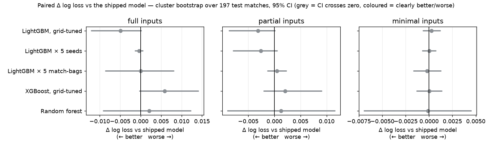
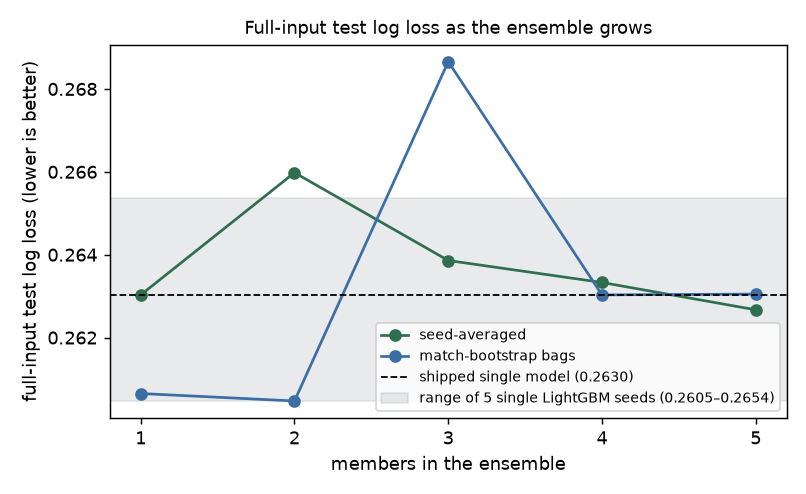

# Boosting vs Bagging — does another tree ensemble beat the shipped xG model?

Run on the held-out test set: 4,988 shots, 456 goals, 197 matches. Scripts: `model_comparison.py` (main run), `seed_check.py` (10-seed follow-up), `plot_results.py`, `build_artifact.py`, this file via `build_report.py`. Raw output: `results/`.

## Findings

**Bagging did not help.** The model is already gradient boosting, and each tree already sees a random 80% of shots and features. Averaging five LightGBM models scored 0.2627 against 0.2630 shipped, no better than the average single model (0.2626). Bagging by resampling whole matches scored 0.2631 with a clearly worse Brier score (+0.0007).

**XGBoost and a random forest were no better, and the forest is far heavier.** XGBoost scored 0.2688 (+0.0059 vs shipped, interval −0.0002 to +0.0142) with a slightly lower AUC (0.8041 vs 0.8051). The random forest scored 0.2652, a clearly worse Brier score, a weaker match to StatsBomb’s own xG (0.884 vs 0.905), and 38 times as many tree nodes (433,826 vs 11,536), which would swell the offline download.

**Most gaps are smaller than re-rolling the random seed.** Retraining the shipped configuration with ten different seeds moves full-input log loss by a standard deviation of 0.0030 and a spread of 0.0095. Every full-input difference in the first comparison is smaller than that spread.

**The one real signal: a tuned LightGBM, about 0.003 better.** The grid picked 15 leaves and depth 6 (shipped: 31 leaves, depth 5). Averaged over ten seeds each it scored 0.2606 vs 0.2636 on full inputs, 0.0030 better, interval −0.0060 to −0.0006. On partial and minimal inputs it made no difference. The single-seed comparison had shown −0.0049, so part of that was luck. It is also 14% smaller.

**With minimal input, the algorithm does not matter.** All six models land within 0.0005 of each other (0.2672 to 0.2677). That ceiling comes from how little the operator entered, not from which tree method reads it.

**Recommendation: keep the shipped model for now.** A 1% log-loss gain in one input level does not justify retraining, since every xG number would shift slightly and the ONNX file, calibrators and parity fixtures would all be regenerated. If the model is retrained anyway, for example with more data, adopt the tuned configuration then and judge changes with multi-seed comparisons like this one.

## Scoreboard

Same protocol as the shipped model (match-level split, same augmentation, same per-bucket isotonic calibration on calibration ∪ validation). Δ is paired (candidate − shipped): lower log loss is better; the interval is a 95% cluster bootstrap over test matches.

### full inputs

| model | log loss | Δ vs shipped [95% CI] | verdict | Brier | AUC | cal-in-large | tree nodes | fit |
|---|---|---|---|---|---|---|---|---|
| LightGBM (shipped) | 0.2630 | reference | — | 0.0709 | 0.8051 | 1.033 | 11,536 (1.0×) | 7.6s |
| LightGBM, tuned | 0.2581 | −0.0049 [−0.0120, +0.0001] | no clear difference | 0.0707 | 0.8065 | 1.028 | 9,968 (0.9×) | 6.3s |
| LightGBM × 5 seeds | 0.2627 | −0.0004 [−0.0013, +0.0006] | no clear difference | 0.0708 | 0.8045 | 1.033 | 53,611 (4.6×) | 21.0s |
| LightGBM × 5 match-bags | 0.2630 | +0.0000 [−0.0085, +0.0081] | no clear difference | 0.0716 | 0.8020 | 1.036 | 44,406 (3.8×) | 20.3s |
| XGBoost, tuned | 0.2688 | +0.0059 [−0.0002, +0.0141] | no clear difference | 0.0712 | 0.8041 | 1.031 | 18,991 (1.6×) | 7.5s |
| Random forest | 0.2652 | +0.0021 [−0.0091, +0.0122] | no clear difference | 0.0722 | 0.7952 | 1.029 | 433,826 (37.6×) | 42.7s |

### partial inputs

| model | log loss | Δ vs shipped [95% CI] | verdict | Brier | AUC | cal-in-large | tree nodes | fit |
|---|---|---|---|---|---|---|---|---|
| LightGBM (shipped) | 0.2596 | reference | — | 0.0720 | 0.7916 | 1.021 | 11,536 (1.0×) | 7.6s |
| LightGBM, tuned | 0.2564 | −0.0032 [−0.0087, +0.0001] | no clear difference | 0.0717 | 0.7929 | 1.024 | 9,968 (0.9×) | 6.3s |
| LightGBM × 5 seeds | 0.2570 | −0.0026 [−0.0079, +0.0005] | no clear difference | 0.0718 | 0.7908 | 1.024 | 53,611 (4.6×) | 21.0s |
| LightGBM × 5 match-bags | 0.2601 | +0.0005 [−0.0013, +0.0023] | no clear difference | 0.0722 | 0.7919 | 1.032 | 44,406 (3.8×) | 20.3s |
| XGBoost, tuned | 0.2616 | +0.0021 [−0.0020, +0.0090] | no clear difference | 0.0718 | 0.7938 | 1.019 | 18,991 (1.6×) | 7.5s |
| Random forest | 0.2608 | +0.0013 [−0.0089, +0.0116] | no clear difference | 0.0725 | 0.7888 | 1.021 | 433,826 (37.6×) | 42.7s |

### minimal inputs

| model | log loss | Δ vs shipped [95% CI] | verdict | Brier | AUC | cal-in-large | tree nodes | fit |
|---|---|---|---|---|---|---|---|---|
| LightGBM (shipped) | 0.2674 | reference | — | 0.0749 | 0.7703 | 1.042 | 11,536 (1.0×) | 7.6s |
| LightGBM, tuned | 0.2677 | +0.0003 [−0.0006, +0.0012] | no clear difference | 0.0749 | 0.7693 | 1.037 | 9,968 (0.9×) | 6.3s |
| LightGBM × 5 seeds | 0.2675 | +0.0000 [−0.0007, +0.0007] | no clear difference | 0.0749 | 0.7697 | 1.042 | 53,611 (4.6×) | 21.0s |
| LightGBM × 5 match-bags | 0.2672 | −0.0002 [−0.0016, +0.0013] | no clear difference | 0.0749 | 0.7695 | 1.042 | 44,406 (3.8×) | 20.3s |
| XGBoost, tuned | 0.2674 | +0.0000 [−0.0013, +0.0014] | no clear difference | 0.0748 | 0.7694 | 1.040 | 18,991 (1.6×) | 7.5s |
| Random forest | 0.2673 | −0.0001 [−0.0069, +0.0045] | no clear difference | 0.0749 | 0.7592 | 1.037 | 433,826 (37.6×) | 42.7s |

## Seed noise (the yardstick)

Retraining the same model with only the random seed changed, each member calibrated individually. Full-input test log loss:

| set | seeds | mean | sd | range |
|---|---|---|---|---|
| shipped config, first run | 5 | 0.26258 | 0.00191 | 0.00489 |
| shipped config, follow-up | 10 | 0.26358 | 0.00301 | 0.00950 |
| tuned config, follow-up | 10 | 0.26055 | 0.00203 | 0.00527 |

## Follow-up: tuned vs shipped LightGBM, 10 seeds each

| inputs | shipped mean ± sd | tuned mean ± sd | tuned − shipped [95% CI] | verdict |
|---|---|---|---|---|
| full | 0.2636 ± 0.0030 | 0.2606 ± 0.0020 | −0.0030 [−0.0060, −0.0006] | better |
| partial | 0.2595 ± 0.0020 | 0.2595 ± 0.0021 | +0.0000 [−0.0008, +0.0010] | no clear difference |
| minimal | 0.2675 ± 0.0009 | 0.2680 ± 0.0010 | +0.0005 [−0.0004, +0.0017] | no clear difference |

## Tuning grids (validation log loss, mean over the 3 buckets)

### LightGBM

| num_leaves | max_depth | min_child_samples | val log loss |
|---|---|---|---|
| 15 | 4 | 30 | 0.27164 |
| 15 | 4 | 60 | 0.26942 |
| 15 | 4 | 120 | 0.27047 |
| 15 | 5 | 30 | 0.26856 |
| 15 | 5 | 60 | 0.26795 |
| 15 | 5 | 120 | 0.27288 |
| 15 | 6 | 30 | 0.27013 |
| 15 | 6 | 60 | 0.26519 ◂ chosen |
| 15 | 6 | 120 | 0.27192 |
| 31 | 4 | 30 | 0.27119 |
| 31 | 4 | 60 | 0.26699 |
| 31 | 4 | 120 | 0.27169 |
| 31 | 5 | 30 | 0.27001 |
| 31 | 5 | 60 | 0.27004 |
| 31 | 5 | 120 | 0.27138 |
| 31 | 6 | 30 | 0.26762 |
| 31 | 6 | 60 | 0.27049 |
| 31 | 6 | 120 | 0.27319 |

### XGBoost

| max_depth | min_child_weight | val log loss |
|---|---|---|
| 4 | 2 | 0.26674 |
| 4 | 5 | 0.26879 |
| 4 | 10 | 0.26993 |
| 5 | 2 | 0.26372 ◂ chosen |
| 5 | 5 | 0.26820 |
| 5 | 10 | 0.26759 |
| 6 | 2 | 0.26732 |
| 6 | 5 | 0.26651 |
| 6 | 10 | 0.26608 |

### Random forest

| min_samples_leaf | max_features | val log loss |
|---|---|---|
| 25 | 0.3 | 0.27854 |
| 25 | 0.6 | 0.27957 |
| 60 | 0.3 | 0.27229 ◂ chosen |
| 60 | 0.6 | 0.27778 |
| 120 | 0.3 | 0.27495 |
| 120 | 0.6 | 0.27858 |

## Method and limits

- The refit of the shipped configuration reproduces the shipped model exactly (max prediction difference 0.0, best iteration 290 = shipped 290).
- Bagging two ways: seed-averaging, and match-bootstrap bagging (each member trained on a resample of whole training matches, via multiplicity weights). Probabilities are averaged then calibrated once.
- Monotone constraints kept for LightGBM and XGBoost. The random forest ran unconstrained (scikit-learn does not support monotone constraints with missing values).
- The validation set that picks each grid winner is also the early-stopping set for the boosted models, which flatters them slightly. The test set was looked at twice (the six-model comparison, then the 10-seed follow-up). One split, one test set of 456 goals.
- Not tried: CatBoost, stacking, feature changes, tuning beyond these small grids, a second random split.
